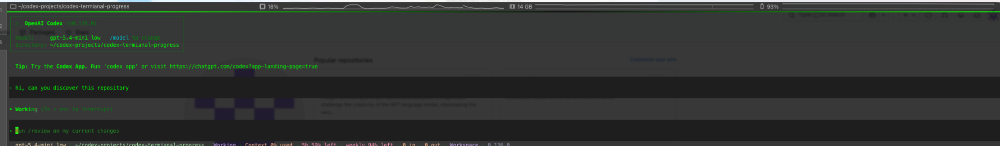
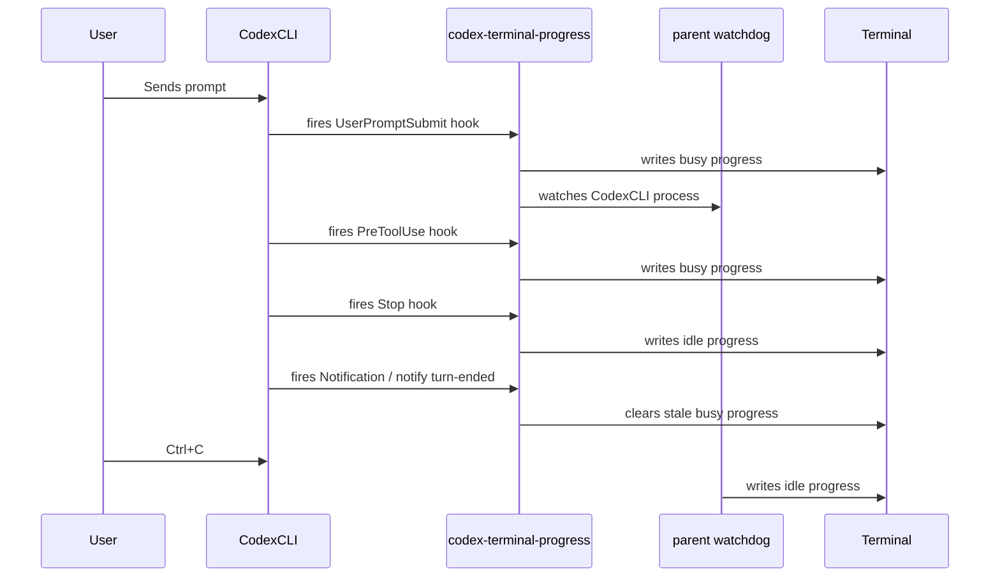

<div align="center">
  <br/>
  <h1>⌨️ codex-terminal-progress</h1>
  <p>
    <strong>See your Codex CLI agent's activity right in the terminal tab.</strong>
    <br/>
    No TUI peeking required.
  </p>

  <picture>
    <source media="(prefers-color-scheme: dark)" srcset="docs/screenshot-terminal.png">
    
  </picture>
  <br/>
  <br/>
  <sub><i>Progress bar states in the terminal tab — spinner, paused, waiting, error, cleared.</i></sub>

  <br/>
  <br/>

  <a href="https://www.npmjs.com/package/codex-terminal-progress"></a>
  <a href="https://www.npmjs.com/package/codex-terminal-progress"></a>
  <a href="https://github.com/bcanozgur/codex-terminal-progress/blob/main/LICENSE"></a>
  <a href="https://nodejs.org/">= 18"/></a>

  <br/>
  <br/>
</div>

---

**codex-terminal-progress** is a [Codex CLI](https://github.com/open-codex/codexcli) plugin that uses [OSC 9;4](https://iterm2.com/documentation-escape-codes.html) escape sequences to display your agent's status in the terminal tab header. Works with **iTerm2**, **WezTerm**, **Ghostty**, and **Windows Terminal**.

> Inspired by [opencode-terminal-progress](https://github.com/pedropombeiro/opencode-plugins/tree/main/packages/terminal-progress).

---

## ✨ Features

- **👀 At-a-glance agent status** — no need to switch to the Codex TUI to know what's happening
- **🔄 Real-time updates** — progress changes as your agent thinks, acts, and responds
- **🛑 Error detection** — turns red when a tool fails
- **⏸️ Permission awareness** — shows paused state when waiting for your approval
- **🔌 Zero-config setup** — single command to configure hooks
- **🪟 tmux compatible** — works transparently inside tmux sessions
- **🎯 Lightweight** — no dependencies, runs as a subprocess and exits immediately

## 📋 Supported Terminals

| Terminal                                                  | Detection                                                   |
| --------------------------------------------------------- | ----------------------------------------------------------- |
| [iTerm2](https://iterm2.com)                              | `TERM_PROGRAM=iTerm.app`, `LC_TERMINAL`, `ITERM_SESSION_ID` |
| [WezTerm](https://wezfurlong.org/wezterm/)                | `TERM_PROGRAM=WezTerm`, `WEZTERM_EXECUTABLE`                |
| [Ghostty](https://ghostty.org)                            | `TERM_PROGRAM=ghostty`                                      |
| [Windows Terminal](https://github.com/microsoft/terminal) | `WT_SESSION`                                                |

## 🚦 Progress States

| Tab Indicator       | What It Means                            |
| ------------------- | ---------------------------------------- |
| 🔄 Spinner          | Agent is thinking or executing a tool    |
| ⏸️ Paused at 50%    | Agent is waiting for your approval       |
| 🟧 Orange at 100%   | Agent is waiting for your input          |
| 🔴 Red bar          | A tool reported a non-zero exit code     |
| (cleared)           | Agent is idle, waiting for your input    |

## 📦 Installation

```bash
npm install -g codex-terminal-progress
```

## ⚙️ Setup

### Auto-setup (recommended)

```bash
codex-terminal-progress setup
```

This appends the required hook entries to `~/.codex/config.toml`.
If you already have a Codex `notify` command, setup preserves it by chaining it
after `codex-terminal-progress notify turn-ended`.

### Manual configuration

Add the following to `~/.codex/config.toml`:

```toml
notify = ["codex-terminal-progress", "notify", "turn-ended"]

[[hooks.SessionStart]]
[[hooks.SessionStart.hooks]]
type = "command"
command = "codex-terminal-progress hook session-start"

[[hooks.UserPromptSubmit]]
[[hooks.UserPromptSubmit.hooks]]
type = "command"
command = "codex-terminal-progress hook user-prompt-submit"

[[hooks.PreToolUse]]
matcher = ".*"

[[hooks.PreToolUse.hooks]]
type = "command"
command = "codex-terminal-progress hook tool-use"

[[hooks.PermissionRequest]]
matcher = ".*"

[[hooks.PermissionRequest.hooks]]
type = "command"
command = "codex-terminal-progress hook permission-request"

[[hooks.Notification]]
[[hooks.Notification.hooks]]
type = "command"
command = "codex-terminal-progress hook notification"

[[hooks.Stop]]
[[hooks.Stop.hooks]]
type = "command"
command = "codex-terminal-progress hook stop"
```

### 🔐 Trust the hooks

Codex requires you to review and trust new hooks before they run:

1. Start Codex: `codex`
2. Type `/hooks` in the Codex CLI prompt
3. Review each hook and press `t` to trust it
4. Restart Codex

Progress indicators will now appear in your terminal tab.

## 🛠️ CLI Reference

```
Usage:
  codex-terminal-progress hook <event>     Handle a Codex hook event
  codex-terminal-progress notify <event>   Handle a Codex notify event
  codex-terminal-progress notify-chain <event> <command...>
                                            Clear progress, then run another notify command
  codex-terminal-progress write <state>    Write a progress state directly
  codex-terminal-progress setup            Add hooks to ~/.codex/config.toml
  codex-terminal-progress status           Check if your terminal is supported

States: busy, idle, error, paused, waiting
```

### Examples

```bash
# Check if your setup is working
codex-terminal-progress status

# Manually test each state
codex-terminal-progress write busy
codex-terminal-progress write paused
codex-terminal-progress write waiting
codex-terminal-progress write error
codex-terminal-progress write idle
```

## 🧩 How It Works

This package leverages **Codex Hooks**, Codex CLI's built-in extensibility framework. When you configure the hooks, Codex invokes the appropriate script at each lifecycle event. The script writes an [OSC 9;4](https://iterm2.com/documentation-escape-codes.html) escape sequence to `/dev/tty`, which tells your terminal emulator to update the progress indicator in the tab header.



### 🛡️ Safety & Resilience

- **Debounce protection** — rapid tool transitions don't cause flickering
- **Parent watchdog** — clears progress when the Codex CLI process can be resolved and exits before it can fire the stop hook
- **Stale session detection** — the next session also clears any previously orphaned progress indicator
- **SIGINT/SIGTERM handlers** — clean up progress on abrupt termination
- **Graceful degradation** — silently exits if `/dev/tty` is unavailable or the terminal is unsupported

### ⚙️ Configuration

| Environment Variable        | Effect                          |
| --------------------------- | ------------------------------- |
| `CODEX_TERMINAL_PROGRESS=0` | Disables terminal progress      |

## 📄 License

MIT
